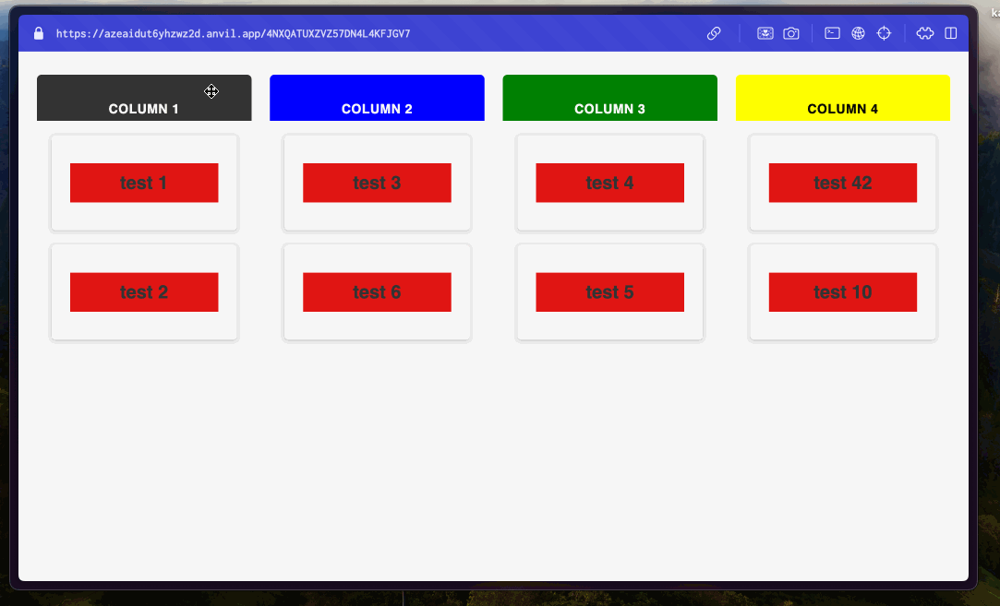

# Anvil Muuri
A dependency for anvil.works that wraps the [Muuri](https://github.com/haltu/muuri) library. Currently, this library focuses on creating the Kanban board using the Muuri library, but will grow to other tools.

This app is available here in github or as a Dependency Clone Link. The dependency contains an example using the Kanban Board in code or in the drag-drop ui.

|||
|---|---|
| Dependency Clone Link | [](https://anvil.works/build#clone:AZEAIDUT6YHZWZ2D=4VTJAN6ZGB7KAPSDZCK4YLOF) |

---
# Kanban



---
# Docs

- [Creating a Kanban Board](#creating-a-kanban-component)
- [Events](#events)
- [Methods](#methods)


---
### Creating a Kanban Component

In JS Muuri a Muuri instance is defined like:
```js
function create_board(items,columns){
  /*
    drag Container defines the container of the board to anchor 
    components when being dragged across the screen.
  */
  var dragContainer = document.querySelector('.drag-container');
  var itemContainers = [].slice.call(document.querySelectorAll('.board-column-content')); // Each Column of your board.
  var columnGrids = [];
  var boardGrid;
  var itemIndex = 0;
  
  console.log("Create Containers")
  // Init the column grids so we can drag those items around.
  itemContainers.forEach(function (container) {
    console.log("Adding Container")
    var grid = new Muuri(container, {
      items: items[itemIndex], // each item in your columns
      dragEnabled: true,
      dragSort: function () {
        return columnGrids;
      },
      dragContainer: dragContainer,
      dragAutoScroll: {
        targets: (item) => {
          return [
            { element: window, priority: 0 },
            { element: item.getGrid().getElement().parentNode, priority: 1 },
          ];
        }
      },
    })
    .on('dragInit', function (item) {
      item.getElement().style.width = item.getWidth() + 'px';
      item.getElement().style.height = item.getHeight() + 'px';
    }) // Function to call when a drag is initialized
    .on('dragReleaseEnd', function (item) {
      item.getElement().style.width = '';
      item.getElement().style.height = '';
      item.getGrid().refreshItems([item]);
    }) //Function to call when a drag is complete
    .on('layoutStart', function () {
      boardGrid.refreshItems().layout();
    }); // Function to call when the board layout is defined.
    
    columnGrids.push(grid);
    itemIndex += 1
  });
  // Init board grid so we can drag those columns around.
  boardGrid = new Muuri('.board', {
    items: columns,
    dragEnabled: true,
    dragHandle: '.board-column-header'
  }); // Second Muuri board to make your columns movable.
```
In Anvil Murri add the Kanban Component in the design view and then set the data and columns at runtime.

```python
    data = [
      {'header':"column 1",'background':'','items':[ItemForm('test 1'),ItemForm('test 2')]},
      {'header':"column 2",'background':'blue','items':[ItemForm('test 3'),ItemForm('test 6')]},
      {'header':"column 3",'background':'green','items':[ItemForm('test 4'),ItemForm('test 5')]},
      {'header':Label(text="column 4",align="center",foreground='black'),'background':'yellow','items':[ItemForm('test 42'),ItemForm('test 10')]}
    ]
    self.board.create_board(data)
```
The data array defines each column in your Kanban board.

There are three keys to define : ```header```,```background```,```items```. ```header``` will be the text displayed at the header of the column. The ```background``` is the color of the background of your header. ```items``` is an array of components that will show your data. These items are the draggable portions of your board.

The Board component will build the board automatically on the ```create_board``` call , if it is in the ```__init__``` function of the parent form. If your data is passed to the Board component AFTER the parent form is initialized, you can manually build the board by calling ```build_board```

---

### Events

When an item is dragged and released the ```'x-items_changed'``` event is called. 

```python

self.board.add_event_handler('x-items_changed',self.handle_change)

def handle_change(self,**event_args):
  column_name = event_args['column']
  item = event_args['item']
  muuri_item = event_args['muuri']

```

---

### Methods

Check the call signatures in the JS Muuri docs for muuri methods that can be called.


```python
# not available in the autocomplete but can still be called
muuri_item.getGrid().refreshItems([muuri_item])
muuri_item.getGrid().layout()
```
---
